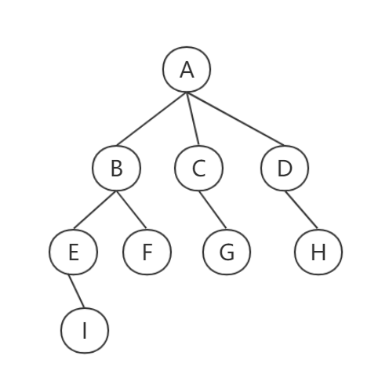

# 基本术语

### 度

树的`结点`包含一个数据元素及若干指向其子树的分支。结点拥有的子树数称为`结点的度`.

eg.上图的A结点的度为3，B位2，C为1，G为0

**ps:`树的度`为树内各结点的度的最大值.**

### 叶子（终端结点）

度为0的结点称为`叶子`或者`终端结点`;不为0的结点称为`非终端结点`和`分支结点`.

### 双亲 孩子

结点子树的根为结点的`孩子`,相应地,结点为孩子的`双亲`.

eg.上图C为A的孩子，A为C的双亲。

### 兄弟

同一个双亲的孩子称为`兄弟`.

eg.B C D为兄弟,E F为兄弟

### 祖先 子孙

由上递推

### 堂兄弟

其双亲结点在同一层次的节点称为`堂兄弟`.

### 深度

树中结点最大层次称为树的`深度`.

eg.上图的层次为4

### 有序树 无序树

若树中结点的各子树看成从左至右是有次序的,则称为`有序树`,否则为`无序树`.有序树最左边的子树称为`第一个孩子`,最右边称为`最后一个孩子`.

### 森林

`森林`是m(m≥1)棵互不相交的树的集合.对于树中的每个结点而言,其子树的集合即为森林.

# 二叉树

