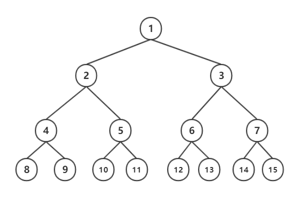
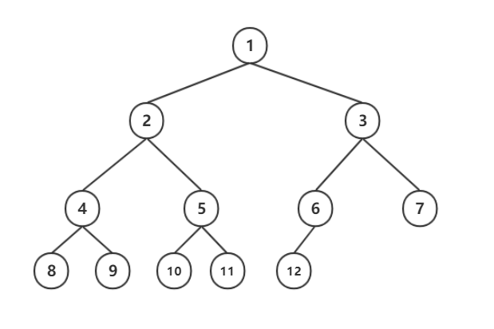

# 基本术语

### 度

树的`结点`包含一个数据元素及若干指向其子树的分支。结点拥有的子树数称为`结点的度`.

eg.上图的A结点的度为3，B位2，C为1，G为0

**ps:`树的度`为树内各结点的度的最大值.**

### 叶子（终端结点）

度为0的结点称为`叶子`或者`终端结点`;不为0的结点称为`非终端结点`和`分支结点`.

### 双亲 孩子

结点子树的根为结点的`孩子`,相应地,结点为孩子的`双亲`.

eg.上图C为A的孩子，A为C的双亲。

### 兄弟

同一个双亲的孩子称为`兄弟`.

eg.B C D为兄弟,E F为兄弟

### 祖先 子孙

由上递推

### 堂兄弟

其双亲结点在同一层次的节点称为`堂兄弟`.

### 深度

树中结点最大层次称为树的`深度`.

eg.上图的层次为4

### 有序树 无序树

若树中结点的各子树看成从左至右是有次序的,则称为`有序树`,否则为`无序树`.有序树最左边的子树称为`第一个孩子`,最右边称为`最后一个孩子`.

### 森林

`森林`是m(m≥1)棵互不相交的树的集合.对于树中的每个结点而言,其子树的集合即为森林.

# 二叉树

`二叉树`(Binary Tree)是另一种树形结构,特点是**每个结点最多只有两棵子树**(即二叉树中不存在度大于2的结点),并且**二叉树的子树有左右之分,其次序不能任意颠倒**.

### 五种基本形态

+ 空二叉树
+ 仅有根节点的二叉树
+ 右子树为空的二叉树
+ 左子树为空的二叉树
+ 左右子树都不为空的二叉树

### 二叉树的性质

**性质1**	在二叉树的第i层上之多有**2^(i-1)**个结点

**性质2**	深度为k的二叉树最多有**2^k - 1**(k≥1)个结点

**性质3**	如果任何一科二叉树T,如果终端结点的数为n0,度为2的结点数为n2,则**n0 = n2 + 1**.

**性质4**	具有n个结点的完全二叉树的深度为**Math.floor(log2n)+1**

**性质5**	如果对一棵有n个结点的完全二叉树（深度为**Math.floor(log2n)+1**）的结点按层序编号（第一层到最后一层，每层从左到右），对任一结点i（1≤i≤n），有：

- 如果i = 1，则结点i是二叉树的根，无双亲；如果i>1，则双亲PARENT(i)是结点Math.floor(i/2)

- 如果2i>n，则结点i无左孩子（结点i为叶子节点）；否则其左孩子LCHILD(i)的结点是2i

- 如果2i + 1 > n，则结点i无右孩子；否则右孩子RCHILD(i)是结点2i+1

  

### 满二叉树

深度为k并且有2^k - 1个结点的二叉树

### 完全二叉树

深度为k,有n个结点的二叉树,当且仅当其每一个结点都与深度为k的满二叉树中编号从1至n的结点一一对应时,即为完全二叉树.

**特点**：

- 叶子节点只会在层数最大的两层出现
- 若右分支的最大层次为l,则左分支的最大层次为l或者l+1

### 二叉树不是树

根本原因：二叉树的子树有左右之分

# 遍历二叉树

三种遍历方法：**先序（根）**遍历，**中序（根）**遍历，**后序（根）**遍历

